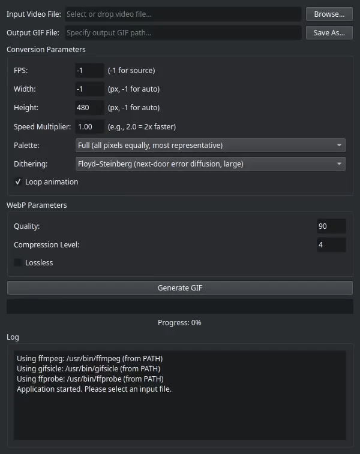

# GifMaker 🖼️✨

<p align="left">
  
  
  
  
  
</p>

> **Turn any video snippet into a razor-sharp GIF or WebP. Just drag, drop, and convert!**

> A desktop frontend for `ffmpeg`, built with PySide6. Tweak, optimize, and convert video clips into perfect GIFs or efficient WebPs—fast!

<div align="center">

<table>
  <tr>
    <td>

## Contents
- [Screenshots](#screenshots)
- [Why GifMaker](#why-gifmaker)
- [Requirements](#requirements)
- [Installation](#installation)
- [Usage](#usage)
- [Features](#features)
- [License](#license)
- [Contributing](#contributing)

</td>
    <td align="center" style="vertical-align: top; padding: 10px;">

<br>
<sub>GifMaker in action. (Converted to WebP by GifMaker)</sub>

</td>
  </tr>
</table>

</div>


## Screenshots


<div align="center">

<table>
  <tr>
    <td align="center" style="vertical-align: top; padding: 10px;">
      <sub>Launch view of the GifMaker interface.</sub><br><br>
      
    </td>
    <td align="center" style="vertical-align: top; padding: 10px;">
      <sub>Sample output. (480p15, WebP @ Quality: 90, Compression: 6)</sub><br><br>
      <br>
      <sub>© 2015 Columbia Pictures. Used under fair use for demonstration purposes.</sub>
    </td>
  </tr>
</table>

</div>

## Why GifMaker

Sick of bloated web tools that mangle your media? GifMaker gives you:
* Fine-grained control over FPS, dithering, compression, and quality
* Drag-and-drop GUI that Just Works™
* Near-instant GIFs or WebPs, tuned exactly how *you* want them

Muck up your GIFs *your* own way—with precision.

## Requirements

* Python 3.10+
* [ffmpeg](https://ffmpeg.org/), [ffprobe](https://ffmpeg.org/ffprobe.html), and [gifsicle](https://www.lcdf.org/gifsicle/) in your system `$PATH`.
* PySide6 (`pip install PySide6` or `pip install -r requirements.txt`)

## Installation

> [!NOTE]
> These instructions are for Unix-like systems. If you don't know what that means, head to [Windows Setup](#-windows-setup)

#### Install dependencies

```bash
# Arch
sudo pacman -S ffmpeg gifsicle

# Debian / Ubuntu
sudo apt install ffmpeg gifsicle
```

#### Clone the repo

```bash
git clone https://github.com/calibancode/GifMaker.git
cd GifMaker
pip install -r requirements.txt
```

#### Update, if necessary
```bash
cd GifMaker
git pull
```

---

### 🪟 Windows Setup

**TL;DR**
With [Chocolatey](https://chocolatey.org/install) installed, just paste these into PowerShell (Admin), one line at a time:
```powershell
choco install git python ffmpeg gifsicle -y
git clone https://github.com/calibancode/GifMaker.git
cd GifMaker
pip install -r requirements.txt
python main.py
```
<details>
  <summary>Step-by-step guide here!</summary>

#### 🧱 Step-by-step

**1. 🧙‍♂️ Install [Chocolatey](https://chocolatey.org/install)**

Open *PowerShell as Administrator* (Search for “PowerShell”, right-click → **Run as Administrator**), then paste in the command from the Chocolatey site.

> [!WARNING]
> If it complains about "execution policy", check with `Get-ExecutionPolicy` — if it says `Restricted`, follow [these steps](https://chocolatey.org/install) to fix it.

Once installed, you get the `choco` package manager. You can use it to install just about anything, and it also makes sure GifMaker finds its dependencies.

**2. 🔧 Install Required Tools**

You'll need:

* **Git** — to download and update the code
* **Python** — the language it runs in (3.10+)
* **ffmpeg** — for video slicing
* **gifsicle** — for GIF optimization

Install them all at once:
```powershell
choco install git python ffmpeg gifsicle
```

> [!TIP]
> Already have one of these? No problem —  `choco` will skip it or upgrade it *and* ensure it's added to your `$PATH`

**3. 📁 Get the Project**

Anywhere in PowerShell (doesn't have to be Admin):

First, navigate to where you'd like to access GifMaker. For example:
```powershell
cd C:\Users\<YourUsername>\Desktop
```

Then, clone the repo:
```powershell
git clone https://github.com/calibancode/GifMaker.git
```

Finally, navigate to the newly created GifMaker folder:
```powershell
cd GifMaker
```

**4. 📦 Install Python Packages**

Still in the GifMaker folder:
```powershell
pip install -r requirements.txt
```

**✅ Run It**

Once everything's in place:
```powershell
python main.py
```
</details>

## Usage

#### Launch the GUI with:
```bash
python main.py
```
#### Or invoke from CLI:
```bash
# Convert to a GIF at 15fps, 480px height
python main.py -i video.mp4 -o out.gif -fps 15 --height 480

# Create a looping lossless WebP
python main.py -i video.mp4 -o out.webp --webp-lossless --loop

# Use custom palette and dithering
python main.py -i video.mp4 -o out.gif --palette=diff --dither=floyd_steinberg
```

## Features

#### User Controls:
- Drag-and-drop input
- Output to `.gif` or `.webp`
- FPS, speed, and resolution tuning
- Scrollable parameters for ease of use
- Quality, compression, and dithering settings
- Looping toggle
- Lossless WebP toggle

#### Advanced controls:
- Palette optimization options for GIFs
- Auto aspect-ratio preservation
- Real-time log viewer
- Cancel conversion mid-process

## License

GPLv3 — you can copy, modify, and redistribute, but derivative work _must stay open_. See [LICENSE](https://github.com/calibancode/GifMaker/blob/main/LICENSE) for more details.

## Contributing

Issues and pull requests are welcome. Fork it, tweak it, send a PR.
