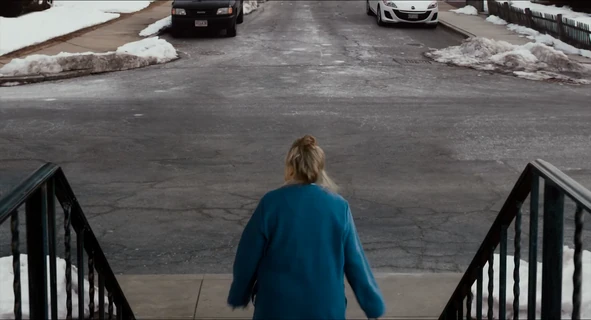

# GifMaker 🖼️✨

<p align="left">
  
  
  
  
  
</p>

> **Turn any video snippet into a razor-sharp GIF or WebP. Just drag, drop, and convert!**

> A desktop frontend for `ffmpeg`, built with PySide6. Tweak, optimize, and convert video clips into perfect GIFs or efficient WebPs—fast!

## Contents
- [Screenshots](#screenshots)
- [Why GifMaker](#why-gifmaker)
- [Requirements](#requirements)
- [Installation](#installation)
- [Usage](#usage)
- [Features](#features)
- [License](#license)
- [Contributing](#contributing)

## Screenshots

<p align="center">
  <sub>Launch view of the GifMaker interface.</sub><br><br>
  
</p>

---

<p align="center">
  <sub>Sample output. (480p15, WebP @ Quality: 90, Compression: 6)</sub><br><br>
  
  <br><sub>© 2015 Columbia Pictures. Used under fair use for demonstration purposes.</sub>
</p>

## Why GifMaker

Sick of bloated web tools that mangle your media? GifMaker gives you:
* Fine-grained control over FPS, dithering, compression, and quality
* Drag-and-drop GUI that Just Works™
* Near-instant GIFs or WebPs, tuned exactly how *you* want them

Muck up your GIFs *your* own way—with precision.

## Requirements

* Python 3.10+
* [ffmpeg](https://ffmpeg.org/), [ffprobe](https://ffmpeg.org/ffprobe.html), and [gifsicle](https://www.lcdf.org/gifsicle/) in your system `$PATH`.
* PySide6 (`pip install PySide6` or `pip install -r requirements.txt`)

## Installation

#### Install dependencies

```bash
# Arch
sudo pacman -S ffmpeg gifsicle

# Debian / Ubuntu
sudo apt install ffmpeg gifsicle
```

#### Clone the repo

```bash
git clone https://github.com/calibancode/GifMaker.git
cd GifMaker
pip install -r requirements.txt
```

#### Update, if necessary
```bash
cd GifMaker
git pull
```

---

#### Windows Setup

You'll need:
* [Chocolatey](https://chocolatey.org/install) — Run the install command in an *admin PowerShell*
* [Git](https://gitforwindows.org/) — or just:
```powershell
choco install git
```
* [Python 3.10+](https://www.python.org/downloads/) — or just:
```powershell
choco install python
```
* `ffmpeg` and `gifsicle` — once Chocolatey is working:
```powershell
choco install ffmpeg gifsicle
```
Then, in any shell:
```powershell
git clone https://github.com/calibancode/GifMaker.git
cd GifMaker
pip install -r requirements.txt
python main.py
```

## Usage

#### Launch the GUI with:
```bash
python main.py
```
#### Or invoke from CLI:
```bash
# Convert to a GIF at 15fps, 480px height
python main.py -i video.mp4 -o out.gif -fps 15 --height 480

# Create a looping lossless WebP
python main.py -i video.mp4 -o out.webp --webp-lossless --loop

# Use custom palette and dithering
python main.py -i video.mp4 -o out.gif --palette=diff --dither=floyd_steinberg
```

## Features

#### User Controls:
- Drag-and-drop input
- Output to `.gif` or `.webp`
- FPS, speed, and resolution tuning
- Scrollable parameters for ease of use
- Quality, compression, and dithering settings
- Looping toggle
- Lossless WebP toggle

#### Advanced controls:
- Palette optimization options for GIFs
- Auto aspect-ratio preservation
- Real-time log viewer
- Cancel conversion mid-process

## License

GPLv3 — you can copy, modify, and redistribute, but derivative work _must stay open_. See [LICENSE](https://github.com/calibancode/GifMaker/blob/main/LICENSE) for more details.

## Contributing

Issues and pull requests are welcome. Fork it, tweak it, send a PR.
